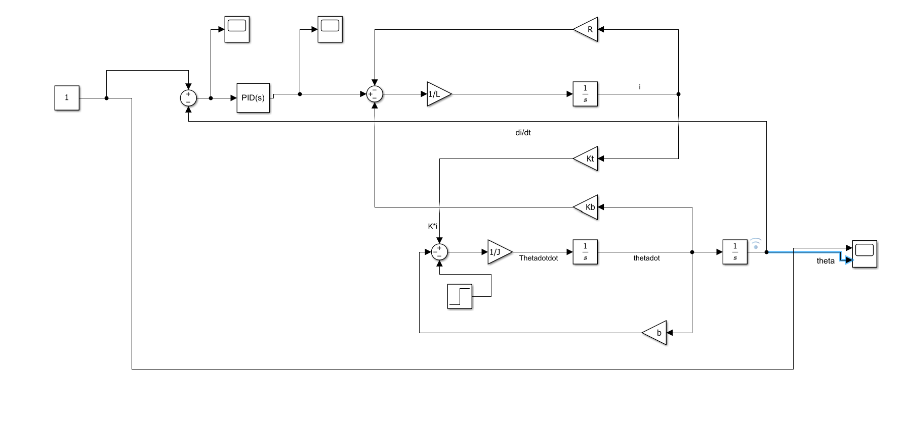

# DC Motor Position Control Using MATLAB and Simulink


## 📌 Project Overview

This project implements **DC Motor Position Control using a PID Controller in MATLAB and Simulink**.

The objective is to control the angular position of a DC motor so that the actual motor position follows a desired reference position of **1 radian**.

The project also evaluates the controller's response to an external **load-torque disturbance** and analyzes important control-system performance parameters such as rise time, peak overshoot, settling time, and steady-state tracking error.

---

## 🎯 Objectives

- Model a DC motor using its electrical and mechanical dynamics.
- Develop a closed-loop position-control system.
- Implement a PID controller in Simulink.
- Track a desired angular position of **1 rad**.
- Introduce an external load-torque disturbance.
- Evaluate disturbance rejection.
- Log simulation data from Simulink into MATLAB.
- Calculate key time-domain performance parameters.

---

## 🛠️ Tools and Technologies

- MATLAB R2026a
- Simulink
- Control System Toolbox
- PID Controller
- DC Motor Modeling
- Feedback Control
- Signal Logging
- Time-Domain Performance Analysis

---

## ⚙️ DC Motor Parameters

The DC motor model uses the following parameters:

| Parameter | Value | Unit |
|---|---:|---|
| Moment of Inertia, J | 3.2284 × 10⁻⁶ | kg·m² |
| Viscous Friction, b | 3.5077 × 10⁻⁶ | N·m·s |
| Back EMF Constant, Kb | 0.0274 | V/(rad/s) |
| Torque Constant, Kt | 0.0274 | N·m/A |
| Armature Resistance, R | 4 | Ω |
| Armature Inductance, L | 2.75 × 10⁻⁶ | H |

---

## 🎛️ PID Controller

The closed-loop position controller uses a PID controller.

### PID Parameters

| Parameter | Value |
|---|---:|
| Kp | 1 |
| Ki | 1 |
| Kd | 0 |

The PID controller compares the desired position with the actual motor position and generates the control voltage required to reduce the position error.

---

## 🔄 Control System

The control system follows a closed-loop architecture:

```text
Desired Position
       │
       ▼
   Error Calculation
       │
       ▼
  PID Controller
       │
       ▼
   Control Voltage
       │
       ▼
    DC Motor
       │
       ▼
Actual Position
       │
       └─────────────── Feedback ───────────────┘
⚡ Load Torque Disturbance

To evaluate disturbance rejection, a step load torque was applied to the motor.

Parameter	Value
Load Torque	0.0001 N·m
Disturbance Time	5 s
Desired Position	1 rad

The disturbance produces a small temporary deviation in the motor position, after which the PID controller compensates and brings the position back toward the reference.

📊 Simulation Results

The simulation was performed for 10 seconds.

The actual motor position successfully tracks the desired position of 1 rad. A small deviation occurs when the load disturbance is introduced at 5 seconds, after which the controller brings the motor position back toward the reference.

## Simulink Model

MATLAB / Control Code

Position Response

📈 Performance Analysis

The response was analyzed using the signal logged from the Simulink model.

Measured Results
Performance Metric	Measured Value
Desired Position	1 rad
10% Crossing Time	0.0108 s
90% Crossing Time	0.0521 s
10–90% Rise Time	0.0413 s
Maximum Position	1.021 rad
Peak Overshoot	≈ 2.1%
±2% Settling Time	0.3899 s
Position at 9 s	0.998 rad
Error at 9 s	0.002 rad (≈ 0.2%)
Rise Time

The response reaches 10% of the desired position at:

t10 = 0.0108 s

and 90% at:

t90 = 0.0521 s

Therefore:

Rise Time = t90 - t10
          = 0.0521 - 0.0108
          = 0.0413 s
Peak Overshoot

The maximum measured position was:

Maximum Position = 1.021 rad

For a desired position of 1 rad:

Peak Overshoot ≈ 2.1%
Settling Time

Using a ±2% settling band around the desired position:

Lower Limit = 0.98 rad
Upper Limit = 1.02 rad

The measured settling time was:

Settling Time = 0.3899 s
Steady-State Tracking

At 9 seconds, the motor position was:

Actual Position = 0.998 rad

Therefore, the position error was approximately:

Error = 1 - 0.998
      = 0.002 rad

which corresponds to approximately:

0.2%
📋 Summary of Controller Performance

The implemented PID controller provides:

Reference position tracking
Fast response
Small peak overshoot
Short settling time
Small steady-state tracking error
Compensation for the applied load-torque disturbance

The measured response demonstrates the behavior of a closed-loop DC motor position-control system under both normal operation and external disturbance conditions.

📁 Repository Contents
DC-Motor-Position-Control-MATLAB-Simulink/
│
├── code.m
├── simulink_model.slx
├── code.png
├── simulink_model.png
├── graph.png
└── README.md

File names may differ depending on the final names used in the repository.

🚀 How to Run
1. Open MATLAB

Open MATLAB R2026a or a compatible version with the required Simulink/control-system functionality.

2. Open the MATLAB Script

Open:

code.m
3. Open the Simulink Model

Open:

simulink_model.slx
4. Run the Simulation

Run the Simulink model for the configured simulation time.

The model generates the desired and actual position response and applies the specified load-torque disturbance.

5. Analyze the Results

The simulation results can be viewed using the configured Scopes.

Signal logging can also be used to transfer simulation data to MATLAB for quantitative performance analysis.

🔬 Key Concepts Demonstrated
DC motor modeling
Electrical motor dynamics
Mechanical motor dynamics
Closed-loop feedback control
PID control
Position tracking
Load disturbance rejection
Signal logging in Simulink
Rise-time analysis
Peak-overshoot analysis
Settling-time analysis
Steady-state error analysis
📌 Conclusion

This project demonstrates the implementation and analysis of a closed-loop DC motor position-control system using a PID controller in MATLAB and Simulink.

The motor tracks the desired 1 radian position with a measured 10–90% rise time of 0.0413 s, approximately 2.1% peak overshoot, and a ±2% settling time of 0.3899 s.

When a 0.0001 N·m load-torque disturbance is introduced at 5 seconds, the motor experiences a small transient deviation and subsequently returns toward the desired position.

The project combines mathematical modeling, Simulink implementation, feedback control, disturbance rejection, and quantitative performance analysis in a single DC motor control application.
